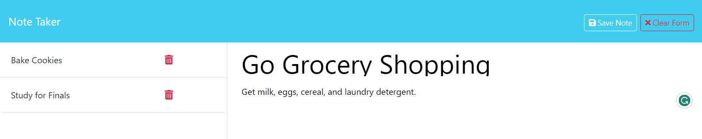

# Note Taker

## Description
A server-based web application for storing and deleting notes.  

## Table of Contents

- [Installation](#installation)
- [Usage](#usage)
- [Credits](#credits)
- [License](#license)
- [How to Contribute](#guidelines)
- [Tests](#tests)
- [Questions](#questions)

## Installation

N/A

## Usage

Click on the "Get Started" button to see and edit your list of notes.
* Add a note title and note, then select the save note button to store a new note.
* Existing notes can be viewed by clicking on them
* Existing notes can be deleted by click on the trash icon

## Credits

* Node.js Copyright [OpenJS Foundation](https://openjsf.org/) and Node.js contributors. All rights reserved. 
* Express.js Copyright © 2017 StrongLoop, IBM, and other expressjs.com contributors.
* cLog is an open source library written by [Joon Kyoung](https://github.com/firejune/clog) and is covered under the MIT license
* UUID is an open source library covered under the MIT license

## License

This application is covered under the MIT License.

## How To Contribute

N/A

## Tests

N/A

## Questions

[GitHub Profile](https://github.com/kevinchogan)

For questions, please contact kchogan@pacbell.net.
